# Architecture — the team agent and the companion

This page shows *how* the pieces fit. *Why* each is built this way, with alternatives and
tradeoffs, is in [design-decisions.md](design-decisions.md); overloaded terms are in the
[glossary](glossary.md#words-with-several-meanings).

Diagrams for the code in Lessons 7–17. They are [Mermaid](https://mermaid.js.org/), which
GitHub renders inline.

| # | Diagram | Type |
|---|---|---|
| 1 | [System context and deployment](#1-system-context-and-deployment) | component |
| 2 | [Components](#2-components) | component |
| 3 | [Team agent — LangGraph](#3-team-agent--langgraph-state-graph) | state graph |
| 4 | [Team agent — one question](#4-team-agent--one-question) | sequence |
| 5 | [Companion — LangGraph](#5-companion--langgraph-state-graph) | state graph |
| 6 | [Companion — session lifecycle](#6-companion--session-lifecycle) | state |
| 7 | [Companion — one chat turn](#7-companion--one-chat-turn) | sequence |
| 8 | [Write path — apply()](#8-write-path--extraction-and-apply) | flowchart |
| 9 | [Read path — recall()](#9-read-path--hybrid-recall) | flowchart |
| 10 | [End of a conversation](#10-end-of-a-conversation) | sequence |
| 11 | [Forgetting a person](#11-forgetting-a-person) | sequence |
| 12 | [Memory data model](#12-memory-data-model) | ER |
| 13 | [Python classes](#13-python-classes) | class |
| 14 | [Life of a memory](#14-life-of-a-memory) | state |
| 15 | [Ontology — how a relation is stored](#15-ontology--how-a-relation-is-stored) | flowchart |
| 16 | [Ontology — two layers in Neo4j](#16-ontology--two-layers-in-neo4j) | graph |
| 17 | [Memory over time — a status's life](#17-memory-over-time--a-statuss-life) | state |
| 18 | [Memory over time — the upkeep job](#18-memory-over-time--the-upkeep-job) | flowchart |
| 19 | [Production — a message with background extraction](#19-production--a-message-with-background-extraction) | sequence |
| 20 | [Production — two writers, one user](#20-production--two-writers-one-user) | sequence |
| 21 | [Graph embeddings — from graph to related pairs](#21-graph-embeddings--from-graph-to-related-pairs) | flowchart |
| 22 | [Personas — who sees what](#22-personas--who-sees-what) | flowchart |
| 23 | [Web UI — components](#23-web-ui--components) | component |

Terms used here are defined in the [glossary](glossary.md).

---

## 1. System context and deployment

Everything runs on your machine except the chat LLM. Embeddings are computed locally.

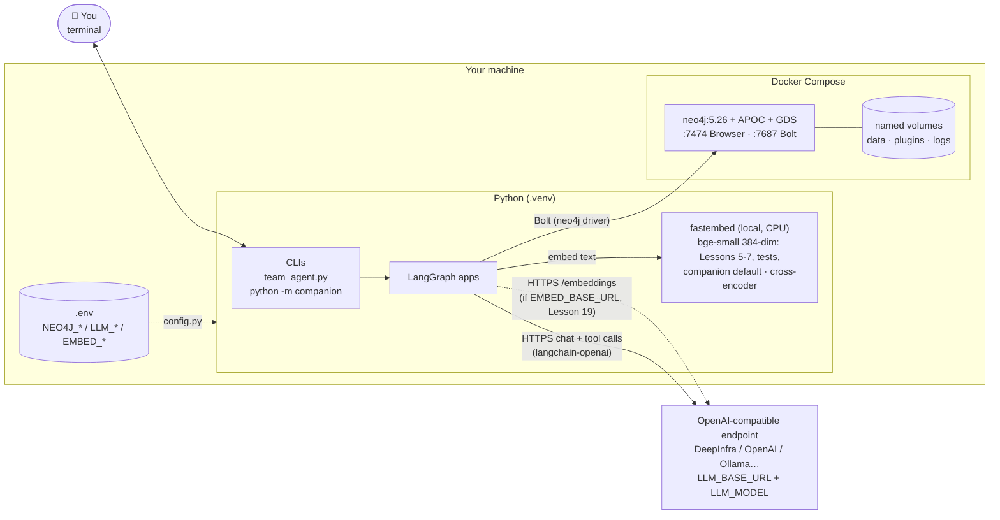
```mermaid
flowchart LR
    user(["👤 You<br/>terminal"])

    subgraph host["Your machine"]
        subgraph py["Python (.venv)"]
            cli["CLIs<br/>team_agent.py<br/>python -m companion"]
            lg["LangGraph apps"]
            fe["fastembed (local, CPU)<br/>bge-small 384-dim: Lessons 5-7, tests,<br/>companion default · cross-encoder"]
        end
        env[(".env<br/>NEO4J_* / LLM_* / EMBED_*")]
        subgraph docker["Docker Compose"]
            neo["neo4j:5.26 + APOC + GDS<br/>:7474 Browser · :7687 Bolt"]
            vol[("named volumes<br/>data · plugins · logs")]
        end
    end

    llm["OpenAI-compatible endpoint<br/>DeepInfra / OpenAI / Ollama…<br/>LLM_BASE_URL + LLM_MODEL"]

    user <--> cli
    cli --> lg
    lg -- "Bolt (neo4j driver)" --> neo
    lg -- "embed text" --> fe
    lg -. "HTTPS /embeddings<br/>(if EMBED_BASE_URL, Lesson 19)" .-> llm
    lg -- "HTTPS chat + tool calls<br/>(langchain-openai)" --> llm
    env -. "config.py" .-> py
    neo --- vol
```

---

## 2. Components

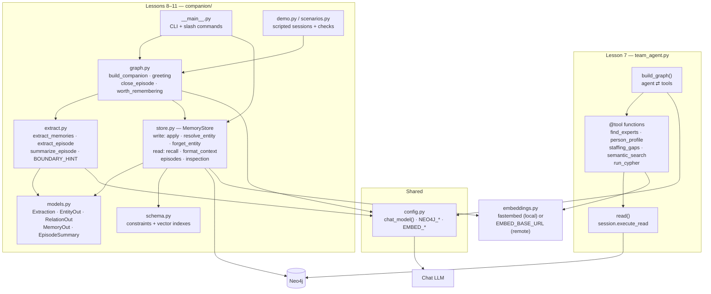
```mermaid
flowchart TB
    subgraph shared["Shared"]
        config["config.py<br/>chat_model() · NEO4J_* · EMBED_*"]
    end

    subgraph agent["Lesson 7 — team_agent.py"]
        tagraph["build_graph()<br/>agent ⇄ tools"]
        tools["@tool functions<br/>find_experts · person_profile<br/>staffing_gaps · semantic_search<br/>run_cypher"]
        read["read()<br/>session.execute_read"]
        tagraph --> tools --> read
    end

    subgraph comp["Lessons 8–11 — companion/"]
        main["__main__.py<br/>CLI + slash commands"]
        demo["demo.py / scenarios.py<br/>scripted sessions + checks"]
        cgraph["graph.py<br/>build_companion · greeting<br/>close_episode · worth_remembering"]
        extract["extract.py<br/>extract_memories · extract_episode<br/>summarize_episode · BOUNDARY_HINT"]
        models["models.py<br/>Extraction · EntityOut · RelationOut<br/>MemoryOut · EpisodeSummary"]
        store["store.py — MemoryStore<br/>write: apply · resolve_entity · forget_entity<br/>read: recall · format_context<br/>episodes · inspection"]
        schema["schema.py<br/>constraints + vector indexes"]

        main --> cgraph
        demo --> cgraph
        main --> store
        cgraph --> extract
        cgraph --> store
        extract --> models
        store --> models
        store --> schema
    end

    neo[("Neo4j")]
    llm["Chat LLM"]
    emb["embeddings.py<br/>fastembed (local) or<br/>EMBED_BASE_URL (remote)"]

    tagraph --> config
    cgraph --> config
    extract --> config
    config --> llm
    read --> neo
    tools --> emb
    store --> neo
    store --> emb
```

---

## 3. Team agent — LangGraph state graph

A standard tool loop. State is the message list; the checkpointer keeps it per `thread_id`.

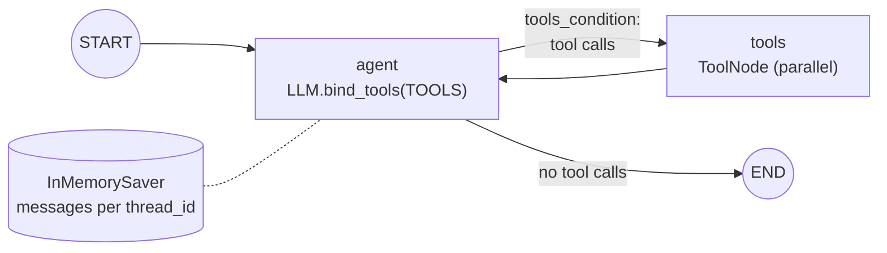
```mermaid
flowchart LR
    S((START)) --> A["agent<br/>LLM.bind_tools(TOOLS)"]
    A -- "tools_condition:<br/>tool calls" --> T["tools<br/>ToolNode (parallel)"]
    T --> A
    A -- "no tool calls" --> E((END))
    CP[("InMemorySaver<br/>messages per thread_id")] -.- A
```

---

## 4. Team agent — one question

"Who could back up Eve if she's out for a month?" ([recorded](../lessons/outputs/07-team-agent.txt))

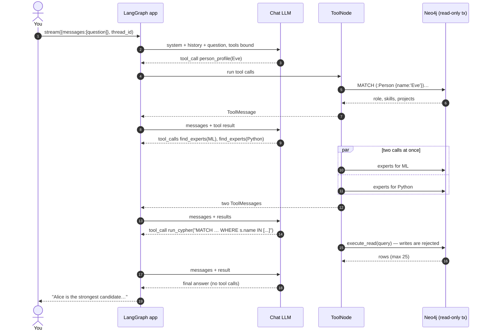
```mermaid
sequenceDiagram
    autonumber
    actor U as You
    participant G as LangGraph app
    participant L as Chat LLM
    participant T as ToolNode
    participant N as Neo4j (read-only tx)

    U->>G: stream({messages:[question]}, thread_id)
    G->>L: system + history + question, tools bound
    L-->>G: tool_call person_profile(Eve)
    G->>T: run tool calls
    T->>N: MATCH (:Person {name:'Eve'})…
    N-->>T: role, skills, projects
    T-->>G: ToolMessage
    G->>L: messages + tool result
    L-->>G: tool_calls find_experts(ML), find_experts(Python)
    par two calls at once
        T->>N: experts for ML
    and
        T->>N: experts for Python
    end
    T-->>G: two ToolMessages
    G->>L: messages + results
    L-->>G: tool_call run_cypher("MATCH … WHERE s.name IN [...]")
    T->>N: execute_read(query) — writes are rejected
    N-->>T: rows (max 25)
    G->>L: messages + result
    L-->>G: final answer (no tool calls)
    G-->>U: "Alice is the strongest candidate…"
```

---

## 5. Companion — LangGraph state graph

`CompanionState` = `messages` + `memory_context` + `memory_log`. The `thread_id` is the
episode id; `today` travels in `config["configurable"]`.

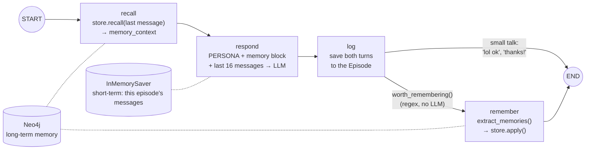
```mermaid
flowchart LR
    S((START)) --> R["recall<br/>store.recall(last message)<br/>→ memory_context"]
    R --> P["respond<br/>PERSONA + memory block<br/>+ last 16 messages → LLM"]
    P --> LG["log<br/>save both turns<br/>to the Episode"]
    LG -- "worth_remembering()<br/>(regex, no LLM)" --> M["remember<br/>extract_memories()<br/>→ store.apply()"]
    LG -- "small talk:<br/>'lol ok', 'thanks!'" --> E((END))
    M --> E

    CP[("InMemorySaver<br/>short-term: this episode's messages")] -.- P
    DB[("Neo4j<br/>long-term memory")] -.- R
    DB -.- M
```

---

## 6. Companion — session lifecycle

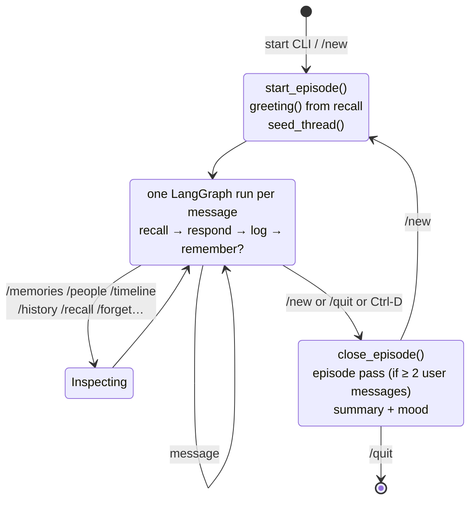
```mermaid
stateDiagram-v2
    [*] --> Opening: start CLI / /new
    Opening: start_episode()<br/>greeting() from recall<br/>seed_thread()
    Opening --> Chatting
    Chatting: one LangGraph run per message<br/>recall → respond → log → remember?
    Chatting --> Chatting: message
    Chatting --> Inspecting: /memories /people /timeline<br/>/history /recall /forget…
    Inspecting --> Chatting
    Chatting --> Closing: /new or /quit or Ctrl-D
    Closing: close_episode()<br/>episode pass (if ≥ 2 user messages)<br/>summary + mood
    Closing --> Opening: /new
    Closing --> [*]: /quit
```

---

## 7. Companion — one chat turn

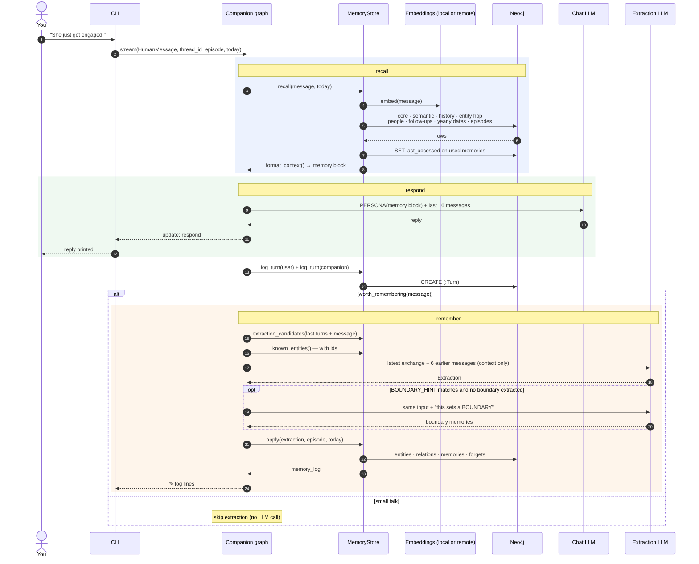
```mermaid
sequenceDiagram
    autonumber
    actor U as You
    participant C as CLI
    participant G as Companion graph
    participant S as MemoryStore
    participant E as Embeddings (local or remote)
    participant N as Neo4j
    participant L as Chat LLM
    participant X as Extraction LLM

    U->>C: "She just got engaged!"
    C->>G: stream(HumanMessage, thread_id=episode, today)

    rect rgba(100,150,240,0.12)
    note over G,N: recall
    G->>S: recall(message, today)
    S->>E: embed(message)
    S->>N: core · semantic · history · entity hop<br/>people · follow-ups · yearly dates · episodes
    N-->>S: rows
    S->>N: SET last_accessed on used memories
    S-->>G: format_context() → memory block
    end

    rect rgba(120,200,140,0.12)
    note over G,L: respond
    G->>L: PERSONA(memory block) + last 16 messages
    L-->>G: reply
    G-->>C: update: respond
    C-->>U: reply printed
    end

    G->>S: log_turn(user) + log_turn(companion)
    S->>N: CREATE (:Turn)

    alt worth_remembering(message)
        rect rgba(240,170,90,0.12)
        note over G,X: remember
        G->>S: extraction_candidates(last turns + message)
        G->>S: known_entities() — with ids
        G->>X: latest exchange + 6 earlier messages (context only)
        X-->>G: Extraction
        opt BOUNDARY_HINT matches and no boundary extracted
            G->>X: same input + "this sets a BOUNDARY"
            X-->>G: boundary memories
        end
        G->>S: apply(extraction, episode, today)
        S->>N: entities · relations · memories · forgets
        S-->>G: memory_log
        G-->>C: ✎ log lines
        end
    else small talk
        note over G: skip extraction (no LLM call)
    end
```

---

## 8. Write path — extraction and apply()

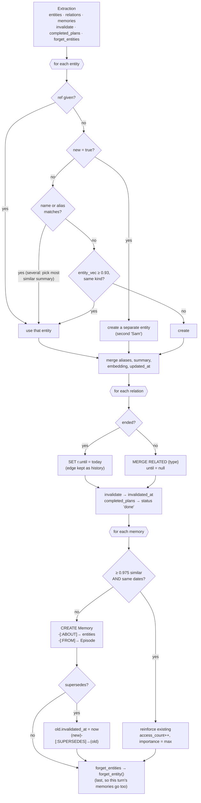
```mermaid
flowchart TD
    X["Extraction<br/>entities · relations · memories<br/>invalidate · completed_plans · forget_entities"]

    X --> ENT{{"for each entity"}}
    ENT --> R1{"ref given?"}
    R1 -- yes --> USE["use that entity"]
    R1 -- no --> R2{"new = true?"}
    R2 -- yes --> NEW["create a separate entity<br/>(second 'Sam')"]
    R2 -- no --> R3{"name or alias<br/>matches?"}
    R3 -- "yes (several: pick most<br/>similar summary)" --> USE
    R3 -- no --> R4{"entity_vec ≥ 0.93,<br/>same kind?"}
    R4 -- yes --> USE
    R4 -- no --> NEW2["create"]
    USE & NEW & NEW2 --> MERGE["merge aliases, summary,<br/>embedding, updated_at"]

    MERGE --> REL{{"for each relation"}}
    REL --> E1{"ended?"}
    E1 -- yes --> UNTIL["SET r.until = today<br/>(edge kept as history)"]
    E1 -- no --> LINK["MERGE RELATED {type}<br/>until = null"]

    UNTIL & LINK --> INV["invalidate → invalidated_at<br/>completed_plans → status 'done'"]

    INV --> MEM{{"for each memory"}}
    MEM --> D{"≥ 0.975 similar<br/>AND same dates?"}
    D -- yes --> REINF["reinforce existing<br/>access_count++, importance = max"]
    D -- no --> CREATE["CREATE Memory<br/>-[:ABOUT]→ entities<br/>-[:FROM]→ Episode"]
    CREATE --> SUP{"supersedes?"}
    SUP -- yes --> OLD["old.invalidated_at = now<br/>(new)-[:SUPERSEDES]→(old)"]
    SUP -- no --> DONE
    OLD --> DONE
    REINF --> DONE

    DONE["forget_entities → forget_entity()<br/>(last, so this turn's memories go too)"]
```

---

## 9. Read path — hybrid recall

All sources run for each message, then `format_context()` builds the memory block in the
system prompt. Filters (in italics) are in Cypher, not the prompt. "Protected" means a
memory ABOUT an entity that an active boundary memory is also ABOUT.

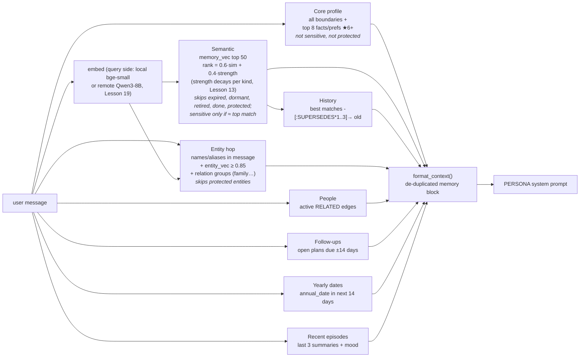
```mermaid
flowchart LR
    Q["user message"] --> EMB["embed (query side: local bge-small<br/>or remote Qwen3-8B, Lesson 19)"]

    EMB --> SEM["Semantic<br/>memory_vec top 50<br/>rank = 0.6·sim + 0.4·strength<br/>(strength decays per kind, Lesson 13)<br/><i>skips expired, dormant, retired, done, protected;<br/>sensitive only if ≈ top match</i>"]
    Q --> CORE["Core profile<br/>all boundaries +<br/>top 8 facts/prefs ★6+<br/><i>not sensitive, not protected</i>"]
    Q --> HOP["Entity hop<br/>names/aliases in message<br/>+ entity_vec ≥ 0.85<br/>+ relation groups (family…)<br/><i>skips protected entities</i>"]
    EMB --> HOP
    Q --> PEOPLE["People<br/>active RELATED edges"]
    Q --> FU["Follow-ups<br/>open plans due ±14 days"]
    Q --> YR["Yearly dates<br/>annual_date in next 14 days"]
    Q --> EP["Recent episodes<br/>last 3 summaries + mood"]

    SEM --> HIST["History<br/>best matches -[:SUPERSEDES*1..3]→ old"]

    CORE & SEM & HIST & HOP & PEOPLE & FU & YR & EP --> FMT["format_context()<br/>de-duplicated memory block"]
    FMT --> PROMPT["PERSONA system prompt"]
```

---

## 10. End of a conversation

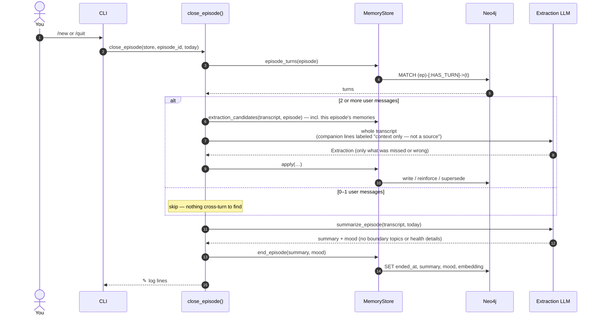
```mermaid
sequenceDiagram
    autonumber
    actor U as You
    participant C as CLI
    participant G as close_episode()
    participant S as MemoryStore
    participant N as Neo4j
    participant X as Extraction LLM

    U->>C: /new or /quit
    C->>G: close_episode(store, episode_id, today)
    G->>S: episode_turns(episode)
    S->>N: MATCH (ep)-[:HAS_TURN]->(t)
    N-->>G: turns

    alt 2 or more user messages
        G->>S: extraction_candidates(transcript, episode) — incl. this episode's memories
        G->>X: whole transcript<br/>(companion lines labeled "context only — not a source")
        X-->>G: Extraction (only what was missed or wrong)
        G->>S: apply(…)
        S->>N: write / reinforce / supersede
    else 0–1 user messages
        note over G: skip — nothing cross-turn to find
    end

    G->>X: summarize_episode(transcript, today)
    X-->>G: summary + mood (no boundary topics or health details)
    G->>S: end_episode(summary, mood)
    S->>N: SET ended_at, summary, mood, embedding
    G-->>C: ✎ log lines
```

---

## 11. Forgetting a person

"Please forget everything about Jordan."

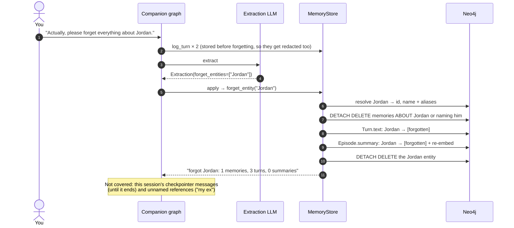
```mermaid
sequenceDiagram
    autonumber
    actor U as You
    participant G as Companion graph
    participant X as Extraction LLM
    participant S as MemoryStore
    participant N as Neo4j

    U->>G: "Actually, please forget everything about Jordan."
    G->>S: log_turn × 2 (stored before forgetting, so they get redacted too)
    G->>X: extract
    X-->>G: Extraction(forget_entities=["Jordan"])
    G->>S: apply → forget_entity("Jordan")
    S->>N: resolve Jordan → id, name + aliases
    S->>N: DETACH DELETE memories ABOUT Jordan or naming him
    S->>N: Turn.text: Jordan → [forgotten]
    S->>N: Episode.summary: Jordan → [forgotten] + re-embed
    S->>N: DETACH DELETE the Jordan entity
    S-->>G: "forgot Jordan: 1 memories, 3 turns, 0 summaries"
    note over G: Not covered: this session's checkpointer messages<br/>(until it ends) and unnamed references ("my ex")
```

---

## 12. Memory data model

Every node has a `user` property so all queries and vector searches are scoped to one person.

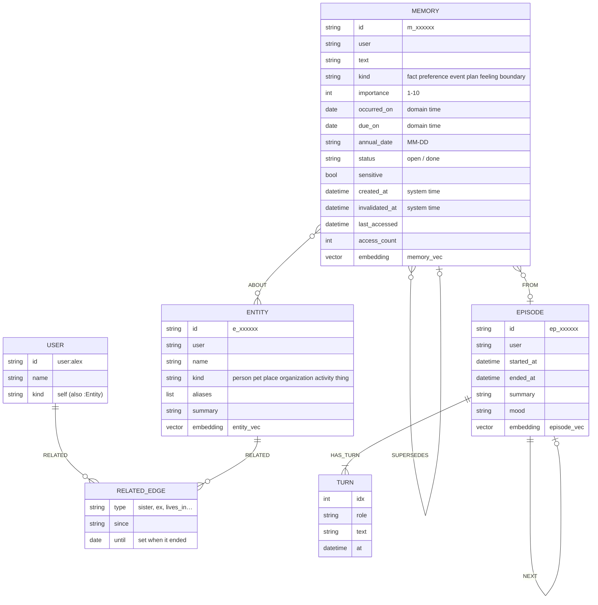
```mermaid
erDiagram
    USER ||--o{ RELATED_EDGE : "RELATED"
    ENTITY ||--o{ RELATED_EDGE : "RELATED"
    RELATED_EDGE {
        string type "sister, ex, lives_in…"
        string since
        date until "set when it ended"
    }
    USER {
        string id "user:alex"
        string name
        string kind "self (also :Entity)"
    }
    ENTITY {
        string id "e_xxxxxx"
        string user
        string name
        string kind "person pet place organization activity thing"
        list aliases
        string summary
        vector embedding "entity_vec"
    }
    MEMORY }o--o{ ENTITY : "ABOUT"
    MEMORY }o--o| MEMORY : "SUPERSEDES"
    MEMORY }o--o| EPISODE : "FROM"
    MEMORY {
        string id "m_xxxxxx"
        string user
        string text
        string kind "fact preference event plan feeling boundary"
        int importance "1-10"
        date occurred_on "domain time"
        date due_on "domain time"
        string annual_date "MM-DD"
        string status "open / done"
        bool sensitive
        datetime created_at "system time"
        datetime invalidated_at "system time"
        datetime last_accessed
        int access_count
        vector embedding "memory_vec"
    }
    EPISODE ||--o| EPISODE : "NEXT"
    EPISODE ||--|{ TURN : "HAS_TURN"
    EPISODE {
        string id "ep_xxxxxx"
        string user
        datetime started_at
        datetime ended_at
        string summary
        string mood
        vector embedding "episode_vec"
    }
    TURN {
        int idx
        string role
        string text
        datetime at
    }
```

---

## 13. Python classes

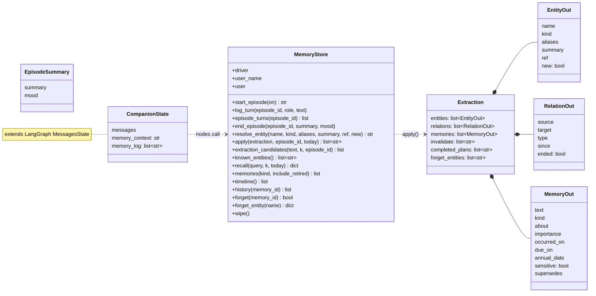
```mermaid
classDiagram
    direction LR
    class MemoryStore {
        +driver
        +user_name
        +user
        +start_episode(on) str
        +log_turn(episode_id, role, text)
        +episode_turns(episode_id) list
        +end_episode(episode_id, summary, mood)
        +resolve_entity(name, kind, aliases, summary, ref, new) str
        +apply(extraction, episode_id, today) list~str~
        +extraction_candidates(text, k, episode_id) list
        +known_entities() list~str~
        +recall(query, k, today) dict
        +memories(kind, include_retired) list
        +timeline() list
        +history(memory_id) list
        +forget(memory_id) bool
        +forget_entity(name) dict
        +wipe()
    }
    class Extraction {
        entities: list~EntityOut~
        relations: list~RelationOut~
        memories: list~MemoryOut~
        invalidate: list~str~
        completed_plans: list~str~
        forget_entities: list~str~
    }
    class EntityOut {
        name
        kind
        aliases
        summary
        ref
        new: bool
    }
    class RelationOut {
        source
        target
        type
        since
        ended: bool
    }
    class MemoryOut {
        text
        kind
        about
        importance
        occurred_on
        due_on
        annual_date
        sensitive: bool
        supersedes
    }
    class EpisodeSummary {
        summary
        mood
    }
    class CompanionState {
        messages
        memory_context: str
        memory_log: list~str~
    }
    Extraction *-- EntityOut
    Extraction *-- RelationOut
    Extraction *-- MemoryOut
    MemoryStore ..> Extraction : apply()
    CompanionState ..> MemoryStore : nodes call
    note for CompanionState "extends LangGraph MessagesState"
```

---

## 14. Life of a memory

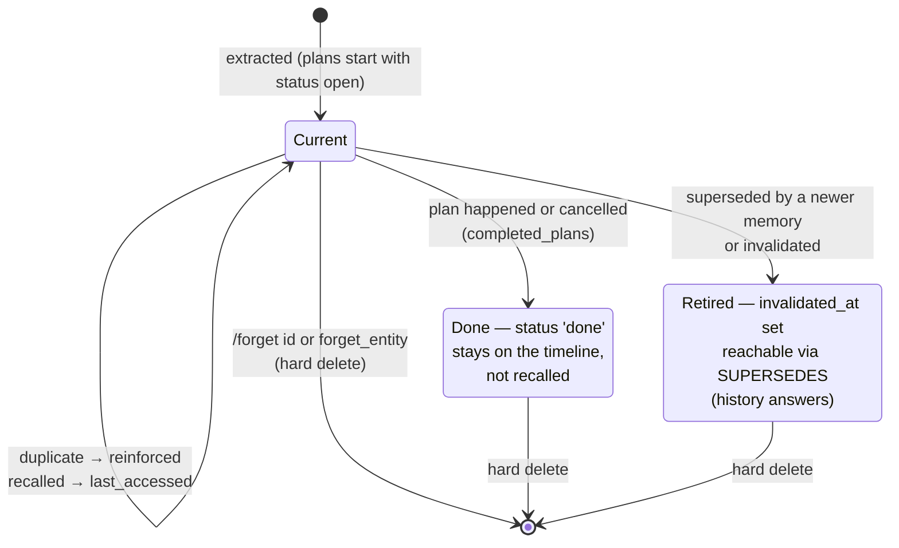
```mermaid
stateDiagram-v2
    [*] --> Current: extracted (plans start with status open)
    Current --> Current: duplicate → reinforced<br/>recalled → last_accessed
    Current --> Done: plan happened or cancelled<br/>(completed_plans)
    Current --> Retired: superseded by a newer memory<br/>or invalidated
    Done: Done — status 'done'<br/>stays on the timeline,<br/>not recalled
    Retired: Retired — invalidated_at set<br/>reachable via SUPERSEDES<br/>(history answers)
    Current --> [*]: /forget id or forget_entity<br/>(hard delete)
    Done --> [*]: hard delete
    Retired --> [*]: hard delete
```

---

## 15. Ontology — how a relation is stored

[Lesson 12](../lessons/12-ontology.md). Every relation the extractor returns goes through
`companion/ontology.py` before it touches the graph.

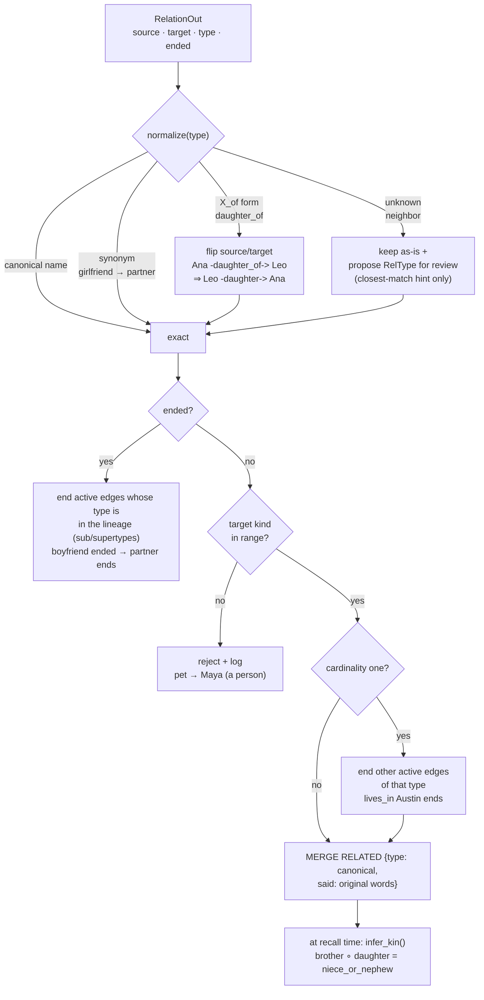
```mermaid
flowchart TD
    IN["RelationOut<br/>source · target · type · ended"] --> NORM{"normalize(type)"}
    NORM -- "canonical name" --> C["exact"]
    NORM -- "synonym<br/>girlfriend → partner" --> C
    NORM -- "X_of form<br/>daughter_of" --> FLIP["flip source/target<br/>Ana -daughter_of-> Leo<br/>⇒ Leo -daughter-> Ana"] --> C
    NORM -- "unknown<br/>neighbor" --> NEW["keep as-is +<br/>propose RelType for review<br/>(closest-match hint only)"] --> C
    C --> END{"ended?"}
    END -- yes --> LIN["end active edges whose type is<br/>in the lineage (sub/supertypes)<br/>boyfriend ended → partner ends"]
    END -- no --> RANGE{"target kind<br/>in range?"}
    RANGE -- no --> REJ["reject + log<br/>pet → Maya (a person)"]
    RANGE -- yes --> CARD{"cardinality one?"}
    CARD -- yes --> MOVE["end other active edges<br/>of that type<br/>lives_in Austin ends"]
    CARD -- no --> LINK
    MOVE --> LINK["MERGE RELATED {type: canonical,<br/>said: original words}"]

    LINK --> INF["at recall time: infer_kin()<br/>brother ∘ daughter = niece_or_nephew"]
```

---

## 16. Ontology — two layers in Neo4j

The **TBox** (types and rules) and the **ABox** (facts) live in the same database. Each
`RELATED` edge's `type` property names a `:RelType`. Recall asks the TBox which types count
as "family" (`-[:SUBTYPE_OF*]->(:RelType {name:'family'})`), then reads the ABox; inference
composes brother ∘ daughter into the dotted niece edge, which is never stored.

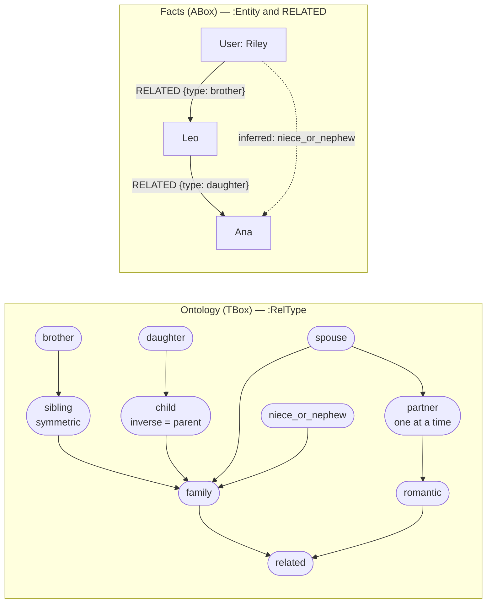
```mermaid
flowchart LR
    subgraph tbox["Ontology (TBox) — :RelType"]
        related(["related"])
        family(["family"]) --> related
        romantic(["romantic"]) --> related
        sibling(["sibling<br/>symmetric"]) --> family
        child(["child<br/>inverse = parent"]) --> family
        brother(["brother"]) --> sibling
        daughter(["daughter"]) --> child
        partner(["partner<br/>one at a time"]) --> romantic
        spouse(["spouse"]) --> partner
        spouse --> family
        nn(["niece_or_nephew"]) --> family
    end

    subgraph abox["Facts (ABox) — :Entity and RELATED"]
        U["User: Riley"] -- "RELATED {type: brother}" --> L["Leo"]
        L -- "RELATED {type: daughter}" --> A["Ana"]
        U -. "inferred: niece_or_nephew" .-> A
    end
```

---

## 17. Memory over time — a status's life

[Lesson 13](../lessons/13-memory-over-time.md). Three clocks: validity (`valid_until`),
decay (strength vs. age) and consolidation (the upkeep job).

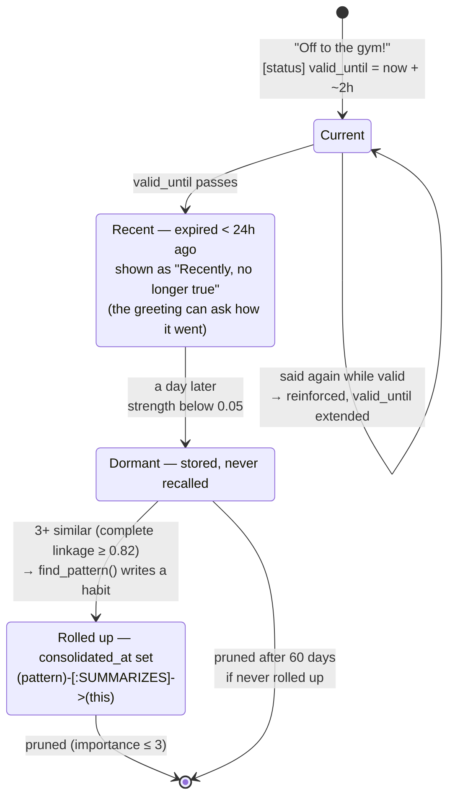
```mermaid
stateDiagram-v2
    [*] --> Current: "Off to the gym!"<br/>[status] valid_until = now + ~2h
    Current --> Recent: valid_until passes
    Recent: Recent — expired < 24h ago<br/>shown as "Recently, no longer true"<br/>(the greeting can ask how it went)
    Recent --> Dormant: a day later<br/>strength below 0.05
    Dormant: Dormant — stored, never recalled
    Current --> Current: said again while valid<br/>→ reinforced, valid_until extended
    Dormant --> RolledUp: 3+ similar (complete linkage ≥ 0.82)<br/>→ find_pattern() writes a habit
    RolledUp: Rolled up — consolidated_at set<br/>(pattern)-[:SUMMARIZES]->(this)
    RolledUp --> [*]: pruned (importance ≤ 3)
    Dormant --> [*]: pruned after 60 days<br/>if never rolled up
```

---

## 18. Memory over time — the upkeep job

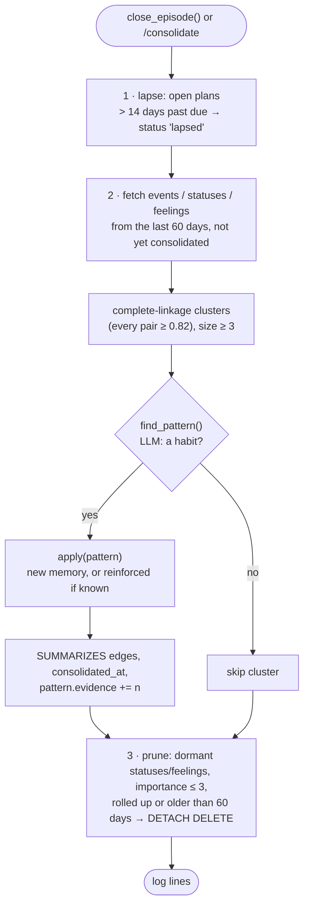
```mermaid
flowchart TD
    start(["close_episode() or /consolidate"]) --> lapse["1 · lapse: open plans<br/>> 14 days past due → status 'lapsed'"]
    lapse --> fetch["2 · fetch events / statuses / feelings<br/>from the last 60 days, not yet consolidated"]
    fetch --> cluster["complete-linkage clusters<br/>(every pair ≥ 0.82), size ≥ 3"]
    cluster --> writer{"find_pattern()<br/>LLM: a habit?"}
    writer -- no --> next["skip cluster"]
    writer -- yes --> apply["apply(pattern)<br/>new memory, or reinforced if known"]
    apply --> link["SUMMARIZES edges, consolidated_at,<br/>pattern.evidence += n"]
    link --> prune
    next --> prune
    prune["3 · prune: dormant statuses/feelings, importance ≤ 3,<br/>rolled up or older than 60 days → DETACH DELETE"]
    prune --> done([log lines])
```

---

## 19. Production — a message with background extraction

The reply doesn't wait for extraction (Lesson 14). The worker runs jobs one at a time, in order.

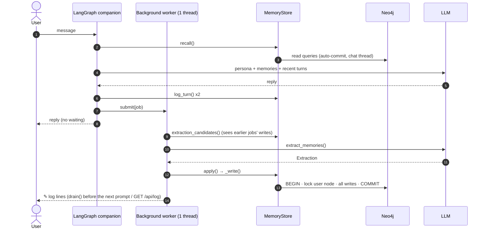
```mermaid
sequenceDiagram
    autonumber
    actor U as User
    participant G as LangGraph companion
    participant W as Background worker (1 thread)
    participant S as MemoryStore
    participant N as Neo4j
    participant L as LLM

    U->>G: message
    G->>S: recall()
    S->>N: read queries (auto-commit, chat thread)
    G->>L: persona + memories + recent turns
    L-->>G: reply
    G->>S: log_turn() x2
    G->>W: submit(job)
    G-->>U: reply (no waiting)
    W->>S: extraction_candidates() (sees earlier jobs' writes)
    W->>L: extract_memories()
    L-->>W: Extraction
    W->>S: apply() → _write()
    S->>N: BEGIN · lock user node · all writes · COMMIT
    W-->>U: ✎ log lines (drain() before the next prompt / GET /api/log)
```

---

## 20. Production — two writers, one user

Without the lock both duplicate checks find nothing and both create. With it, the second
waits, then sees the first one's memory.

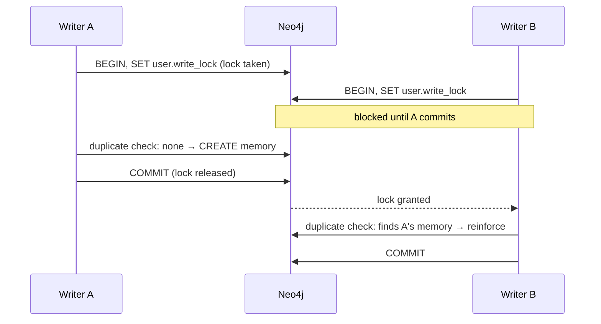
```mermaid
sequenceDiagram
    participant A as Writer A
    participant N as Neo4j
    participant B as Writer B
    A->>N: BEGIN, SET user.write_lock (lock taken)
    B->>N: BEGIN, SET user.write_lock
    Note over B,N: blocked until A commits
    A->>N: duplicate check: none → CREATE memory
    A->>N: COMMIT (lock released)
    N-->>B: lock granted
    B->>N: duplicate check: finds A's memory → reinforce
    B->>N: COMMIT
```

---

## 21. Graph embeddings — from graph to related pairs

```mermaid
flowchart LR
    life[("this user's entities + current memories<br/>ABOUT / RELATED edges")] --> filter["leave out: the user node, sensitive,<br/>private to others, boundary-protected"]
    filter --> proj["gds.graph.project(...)<br/>in-memory, undirected"]
    proj --> fastrp["FastRP<br/>128 dims, weights [0, 1, 1], seed 42"]
    fastrp --> knn["kNN over entities<br/>topK, seed 42, concurrency 1"]
    knn --> cut["score > 0.6<br/>(0.5 = unrelated)"]
    proj --> jac["node similarity (Jaccard)<br/>shared direct neighbours"]
    cut --> out(["/related, GET /api/related"])
    jac --> out
    proj -. "finally" .-> drop["gds.graph.drop"]
```

---

## 22. Personas — who sees what

```mermaid
flowchart TD
    m["memory / relation / episode<br/>agent = who heard it"] --> b{"boundary?"}
    b -- yes --> shared["shared: every persona respects it"]
    b -- no --> p{"'just between us'<br/>or sensitive?"}
    p -- no --> shared2["shared"]
    p -- yes --> priv["private to that persona"]
    priv --> hide["also hidden from others:<br/>entities only it mentions, their relations,<br/>episode summaries, patterns, graph insights"]
    shared2 --> reads["every read path:<br/>visible(v) = v.agent IS NULL OR v.agent = $agent<br/>OR NOT v.private"]
    priv --> reads
```

---

## 23. Web UI — components

```mermaid
flowchart LR
    browser(["browser<br/>index.html + d3"]) -- "fetch JSON" --> api["FastAPI<br/>companion/web.py"]
    api --> chat["Chat<br/>store · LangGraph app · worker · episode"]
    chat --> store["MemoryStore<br/>(same code as the CLI)"]
    chat --> worker["Background worker"]
    worker --> store
    api --> ins["insights.related()"]
    ins --> store
    store --> neo[("Neo4j")]
    chat --> llm(["LLM"])
    worker --> llm
    browser -. "poll GET /api/log<br/>while busy" .-> api
```
